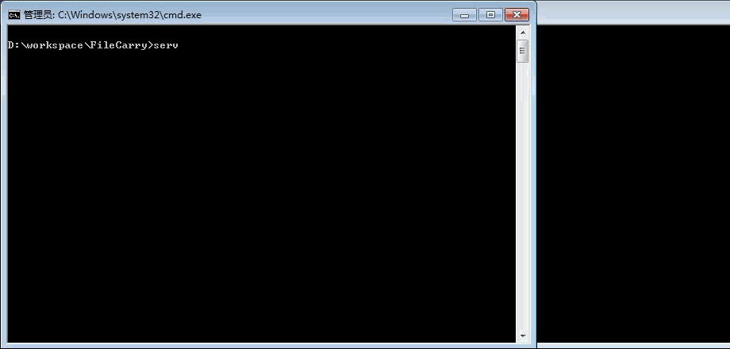

# FileCarry - 一枚局域网文件搬运工  \_(:з」∠)\_

## 简介

这是我毕业设计时期写的一个工具，当时需要多台机器跑一个matlab程序，程序会生成一些文件数据，挨个机器收集十分麻烦，于是我写了这个工具并搭建了一个简单的分布式数据收集系统，自动化收集数据。

简单来说，这是一个局域网内传输数据的工具。

要在局域网内传输数据，首先要知道文件数据 **发送端的IP** 和 **接收端的IP**。

该程序支持从 **客户端发送文件，服务端接收文件**。

也就是说服务端开启的是一个文件接收服务程序，
客户端开启的是文件发送程序。

该工具是用python写的，但是我把转换之后的.exe文件也放在这里，没有python环境的可以直接运行client.exe和server.exe使用。

## 如何使用

### 本机运行步骤（即发送文件给自己）

### step 1 ： 将项目clone到本地，进入项目目录

```
git clone https://github.com/windcode/FileCarry.git
```

### step 2 ： 修改conf.ini文件，配置IP地址


（因为是用本机测试，将文件发送给自己，所以client IP填`localhost`，server IP填`0.0.0.0`）

### step 3 : 打开服务端程序

双击server.py运行

（如果你没有安装python，那么双击server.exe运行）

### step 4 : 使用客户端程序发送文件给服务端

当前目录命令行中执行

```client.py conf.ini FileCarry.py``` 

（如果你没有安装python，你可以将待发送文件拖动到client.exe上，会自动发送。）

### step 5 : 到recv文件夹查看接收到的文件


### 操作演示



### 多机运行步骤

修改 step 2 中conf.ini文件中的IP地址即可。

`client = 客户端IP地址`

`server = 服务端IP地址`

客户端和服务端需在同一局域网下。

**注意**：客户端为发送方，服务端为接收方。

其余步骤与本机运行类似。


## 截图

多台机器收集数据的场景：


## 注意

* 测试环境为windows

* 运行服务端和客户端程序的机器需要在同一局域网下，或者你用本机测试也可以。

* 提供exe可执行文件发布器py2exe.py，可将python文件干净的转换为exe可执行文件。 py2exe.py需配合PyInstaller使用，请自行下载，详情请参考：[使用pyInstaller发布PathMerge的exe版本（py转换成exe）](http://www.cnblogs.com/yym2013/p/5509263.html)
